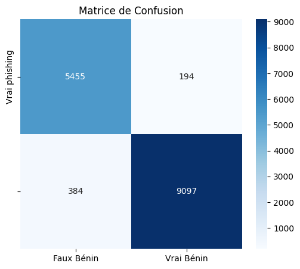
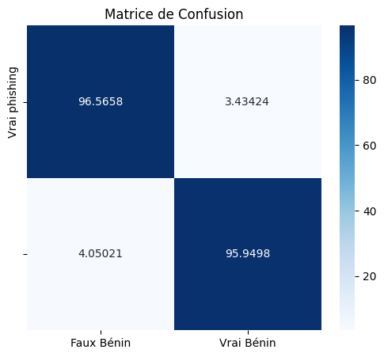

# 🔒 Detectish : Détection de phishing avec intelligence artificielle

Version anglaise : [ici](README.md)

## 📖 Table des matières

- [🌟 Introduction](#-introduction)
- [🛠️ Fonctionnalités](#️-fonctionnalités)
- [📸 Capture d'écran](#capture-décran)
- [🚀 Performances de l'analyse](#-performances-de-lanalyse)
- [🏗️ Installation et Configuration](#️-installation-et-configuration)
  - [Prérequis](#prérequis)
  - [Étapes d'installation](#étapes-dinstallation)
- [👥 Auteurs](#-auteurs)
- [⚠️ Avertissement](#avertissement-️)

## 🌟 Introduction

**Detectish** est une solution conteneurisée qui met en place une infrastructure d'analyse des emails à l'aide de diverses technologies. Grâce à cette solution, vous pouvez visualiser les résultats de l'analyse, voir quels tests ont échoué et consulter la liste des emails mis en quarantaine. Pour les utilisateurs ayant peu de connaissances en sécurité informatique, nous avons intégré Mistral AI (via un token API) qui explique de manière détaillée pourquoi certains tests ont échoué et pourquoi l'email a été mis en quarantaine.

## 🛠️ Fonctionnalités

Detectish analyse les emails en utilisant différentes méthodes :

- **Analyse SPF** [(Sender Policy Framework)](https://fr.wikipedia.org/wiki/Sender_Policy_Framework)
- **Analyse DMARC** [(Domain-based Message Authentication)](https://fr.wikipedia.org/wiki/DMARC)
- **Analyse DKIM** [(DomainKeys Identified Mail)](https://fr.wikipedia.org/wiki/DomainKeys_Identified_Mail)
- **Analyse des pièces jointes** avec [ClamAV](https://www.clamav.net/)
- **Analyse des liens** via un modèle BERT fine-tuné
- **Analyse du texte** de l’email avec le même modèle BERT
- **Liste noire** permettant de mettre automatiquement certaines adresses email en quarantaine

Les emails sont ensuite stockés dans une base de données MySQL.
Le site web est développé en **Vue.js** pour le frontend et **Express.js** pour le backend.

## Capture d'écran

TODO

## 🚀 Performances de l'analyse

L'intelligence artificielle utilisée atteint une précision proche de 95 %. Les tests ont été réalisés sur une base de données disponible sur [Kaggle](https://www.kaggle.com/datasets/subhajournal/phishingemails).

- **Matrice de confusion**  
  

- **Matrice de confusion (pourcentage)**  
  

> Plus de 10 000 emails ont été analysés avec les résultats présentés ci-dessus.

Le modèle AI est disponible sur [Hugging Face](https://huggingface.co/ealvaradob/bert-finetuned-phishing).

## 🏗️ Installation et Configuration

### Prérequis

- **Docker** & **Docker Compose**
- Une machine avec au minimum **4 Go de RAM disponible pour docker** (8 Go recommandés pour de meilleures performances)
- Un fichier `.env` avec les variables de configuration suivantes :

```env
MISTRAL_API_KEY=mistral_api_key

DB_NAME=detectish_db
DB_USER=detectish_user
DB_PASSWORD=detectish_password
DB_HOST=localhost
DB_PORT=3306

CLAMAV_HOST=localhost
CLAMAV_PORT=3310

# Configuration pour le web
BACKEND_PORT=3000
FRONTEND_PORT=8000

JWT_SECRET=your_secure_random_string_here
```

### Étapes d'installation

1. **Cloner le dépôt** :

   ```bash
   git clone https://github.com/Matth-L/detectish.git
   cd detectish
   ```

2. **Construire et démarrer les conteneurs Docker** :
   ```bash
   docker-compose up -d
   ```

## 👥 Auteurs

- **Esteban Becker**
- **Matthias Lapu**
- **Eliséo Chaussoy**

### Avertissement ⚠️

Ce projet a été développé dans le cadre d'un travail universitaire. Il n'a jamais été testé en environnement réel, et son bon fonctionnement n'est pas garanti. Utilisez-le à vos risques et périls ! 🚧
