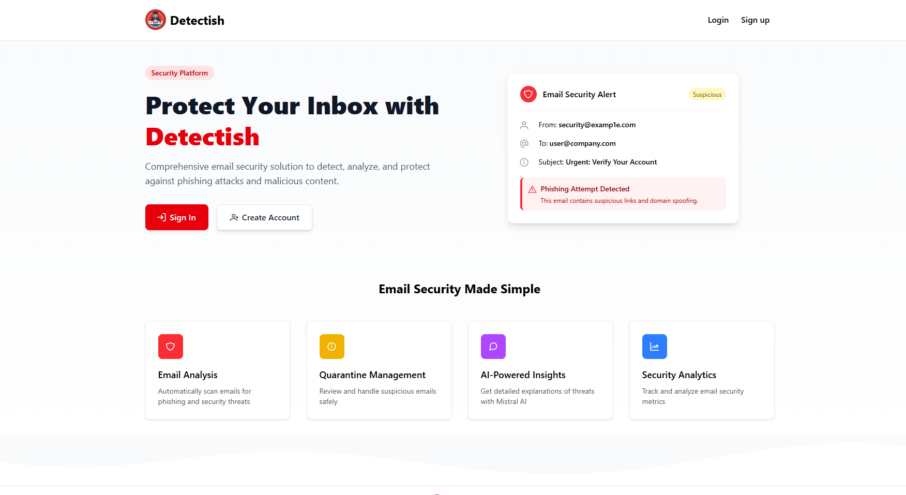
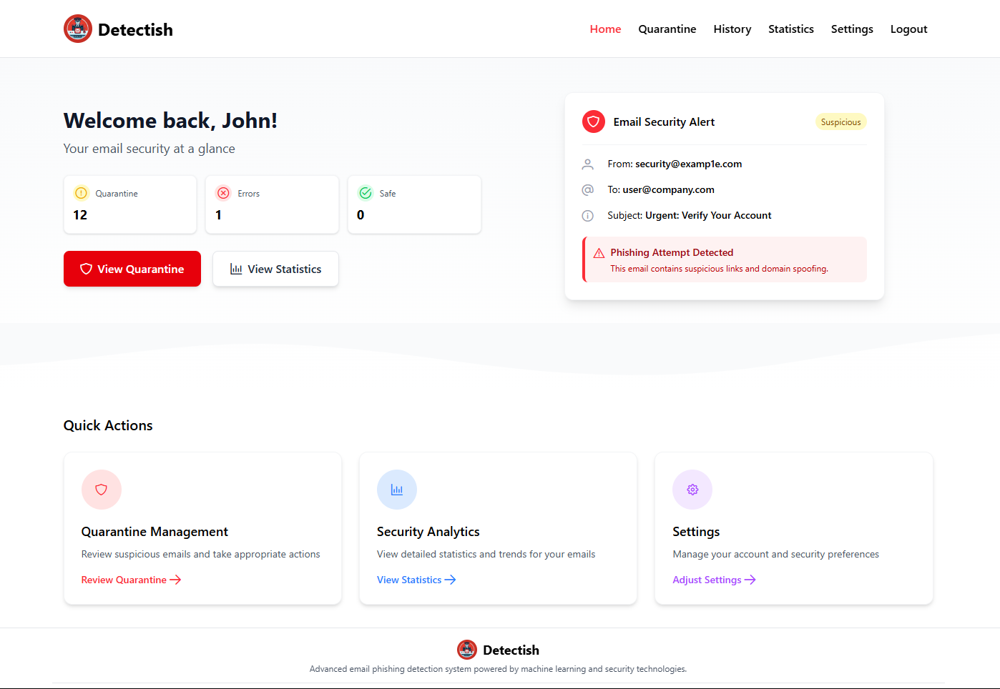
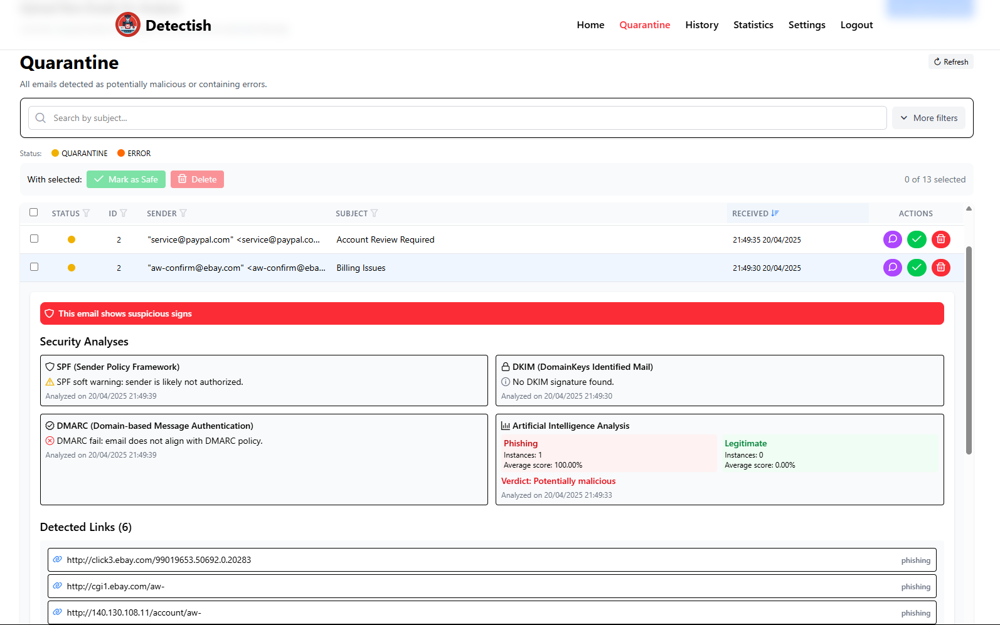
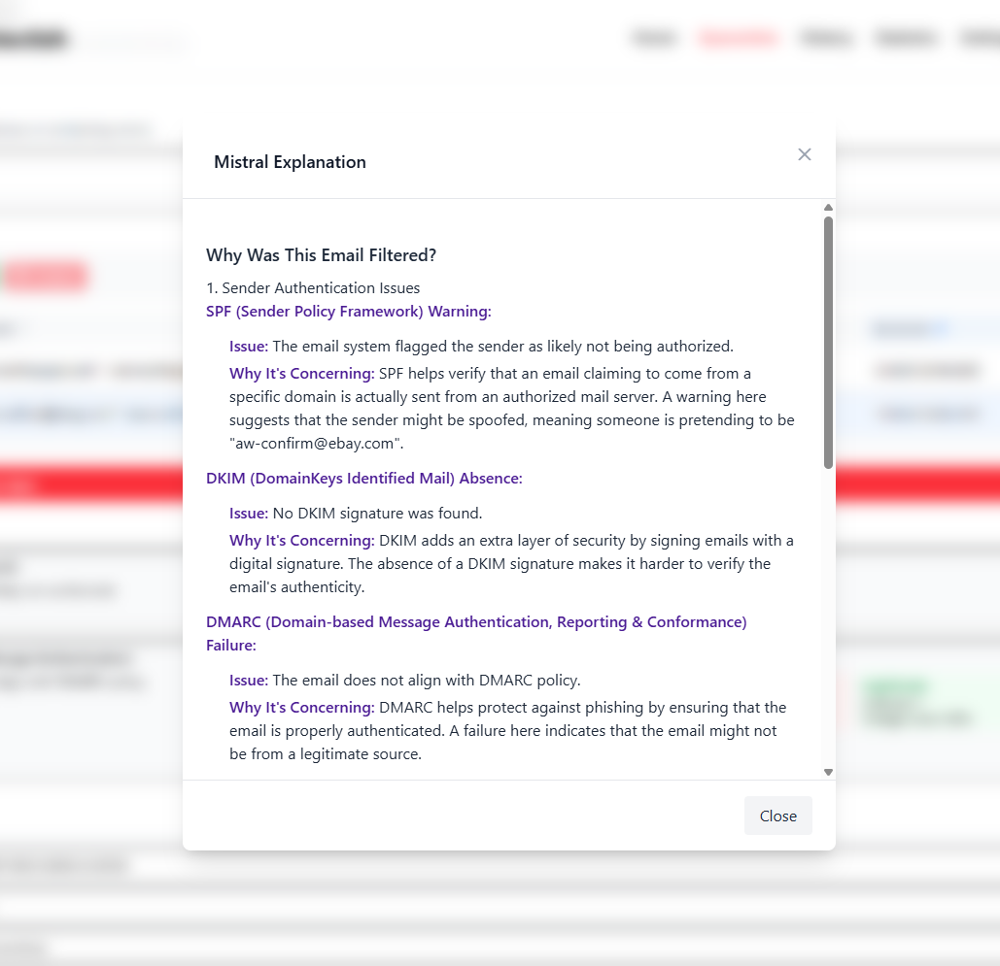
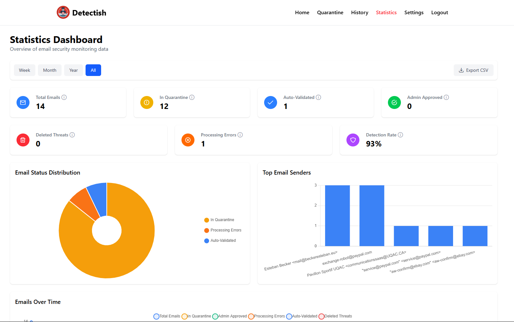
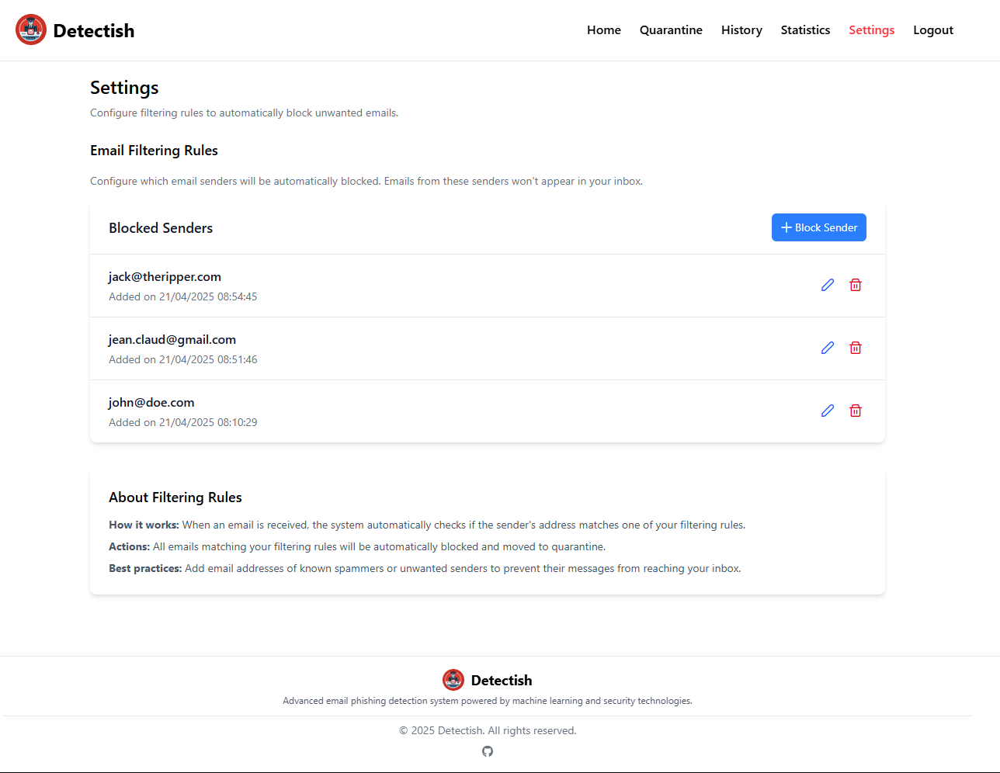

# 🔒 Detectish: Phishing Detection using Artificial Intelligence

French version : [French README](./README-fr.md)

## 📖 Table of Contents

- [🔒 Detectish: Phishing Detection using Artificial Intelligence](#-detectish-phishing-detection-using-artificial-intelligence)
  - [📖 Table of Contents](#-table-of-contents)
  - [🌟 Introduction](#-introduction)
  - [🛠️ Features](#️-features)
  - [📸 Detectish: What Does It Look Like?](#-detectish-what-does-it-look-like)
  - [🚀 Analysis Performance](#-analysis-performance)
  - [🏗️ Setup and Configuration](#️-setup-and-configuration)
    - [Prerequisites](#prerequisites)
    - [Installation Steps](#installation-steps)
  - [👥 Authors](#-authors)
    - [Disclaimer ⚠️](#disclaimer-️)

## 🌟 Introduction

**Detectish** is a containerized solution that sets up an email analysis infrastructure using various technologies. With this solution, you can view the analysis results, see which tests failed, and check the list of quarantined emails. For users with limited cybersecurity knowledge, we have integrated Mistral AI (via an API token) that provides detailed explanations of why certain tests failed and why an email was quarantined.

## 🛠️ Features

Detectish analyzes emails using multiple methods:

- **SPF Analysis** [(Sender Policy Framework)](https://en.wikipedia.org/wiki/Sender_Policy_Framework)
- **DMARC Analysis** [(Domain-based Message Authentication)](https://en.wikipedia.org/wiki/DMARC)
- **DKIM Analysis** [(DomainKeys Identified Mail)](https://en.wikipedia.org/wiki/DomainKeys_Identified_Mail)
- **Attachment Analysis** with [ClamAV](https://www.clamav.net/)
- **Link Analysis** using a fine-tuned BERT model
- **Email Text Analysis** using the same BERT model
- **Blacklist** functionality to automatically quarantine specific email addresses

The emails are then stored in a MySQL database. The web interface is developed using **Vue.js** for the frontend and **Express.js** for the backend.

## 📸 Detectish: What Does It Look Like?

Here is what the Detectish interface looks like without a connection:


With a connection:


The quarantine page where you can see emails deemed suspicious or dangerous by our solution:


Explanation of analysis results provided by Mistral AI:


Statistics on analyzed emails to get an overview of the situation:


The blacklist of emails that are automatically quarantined:


## 🚀 Analysis Performance

The artificial intelligence used reaches an accuracy of nearly 95%. The tests were conducted on a dataset available on [Kaggle](https://www.kaggle.com/datasets/subhajournal/phishingemails).

- **Confusion Matrix**  
  

- **Confusion Matrix (Percentage)**  
  

> Over 10,000 emails were analyzed, as illustrated by the results above.

The AI model is available on [Hugging Face](https://huggingface.co/ealvaradob/bert-finetuned-phishing).

## 🏗️ Setup and Configuration

### Prerequisites

- **Docker** & **Docker Compose**
- A machine with a minimum of **4 GB RAM allocated for docker** (8 GB recommended for better performance)
- A `.env` file containing the following configuration variables:

```env
# Database configuration
DB_NAME=detectish_db
DB_USER=detectish_user
DB_PASSWORD=detectish_password
DB_HOST=mysql
DB_PORT=3306

# MySQL root credentials
MYSQL_ROOT_PASSWORD=MYSQL_ROOT_PASSWORD
MYSQL_DATABASE=detectish_db
MYSQL_USER=detectish_user
MYSQL_PASSWORD=detectish_password

# ClamAV configuration
CLAMAV_HOST=clamav
CLAMAV_PORT=3310

# API Keys
MISTRAL_API_KEY=your_mistral_api_key # Replace with your Mistral API key

# Security
JWT_SECRET=your_secure_random_string_here # Replace with a secure random string

# Frontend configuration
VITE_API_URL=/api
VITE_BACKEND_URL=http://backend:3000
VITE_DETECTISH_URL=http://detectish:6969
```

### Installation Steps

1. **Clone the repository**:

   ```bash
   git clone https://github.com/Matth-L/detectish.git
   cd detectish
   ```

2. **Build and start the Docker containers**:

   ```bash
   docker-compose up -d
   ```

## 👥 Authors

- **Esteban Becker**
- **Matthias Lapu**
- **Eliséo Chaussoy**

### Disclaimer ⚠️

This project was developed as part of a university assignment. It has never been tested in a real-world environment, even though everything should work it is not guaranteed. Use it at your own risk! 🚧
